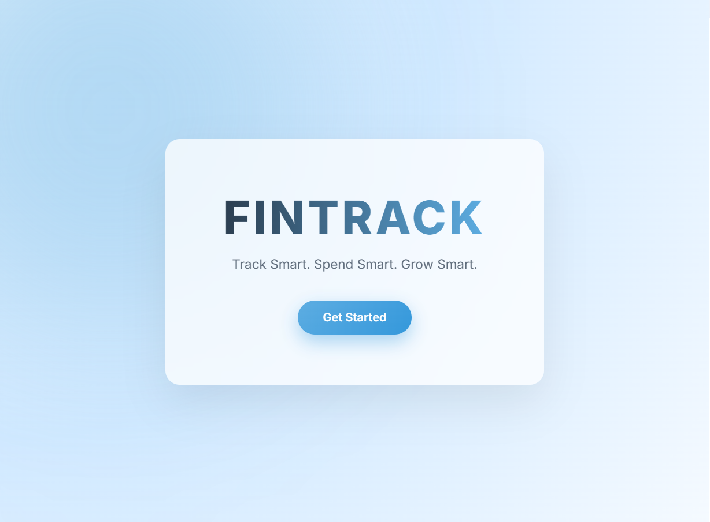
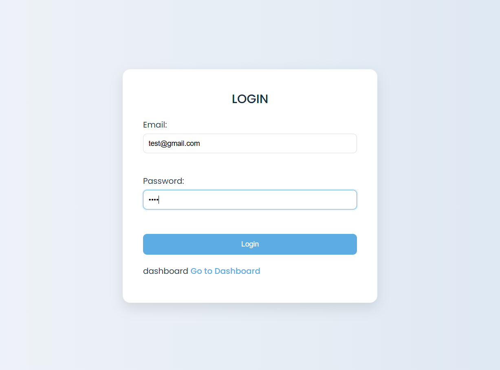
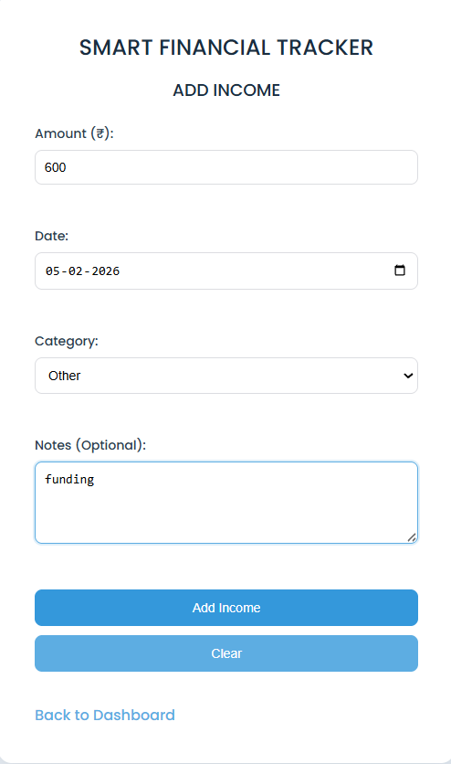
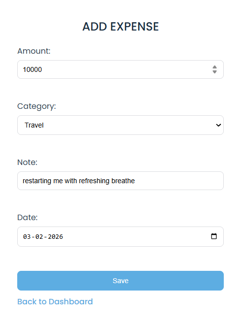
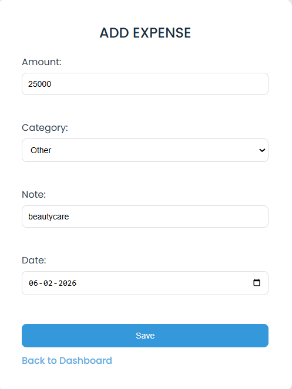
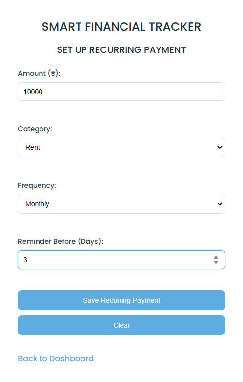
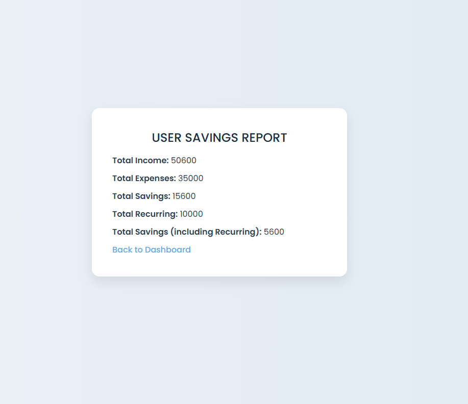

💰 Smart Financial Tracker

A simple, clean, and user-friendly web application that helps users track income, expenses, recurring payments, and savings efficiently.

📌 Project Description

Smart Financial Tracker is a beginner-friendly financial management web application designed to help individuals monitor their daily income and expenses.

The system allows users to:

* Add income sources
* Track expenses
* Manage recurring payments (EMI, rent, subscriptions, etc.)
* View financial summaries and savings reports
* Monitor balance and spending alerts

 🛠 Tech Stack

Frontend:

* HTML5
* CSS3
* JavaScript (Vanilla JS)

Version Control:

* Git & GitHub

✨ Features

✔ User Registration & Login
✔ Add Income with Category & Date
✔ Add Expense with Category & Date
✔ Recurring Payment Management
✔ Dashboard Financial Overview
✔ Balance Calculation
✔ Spending Alerts (50%, 90%, 100%)
✔ Savings Report Page
✔ Clean & Calm Responsive UI

📥 Installation Commands

Clone the repository:
git clone https://github.com/anleter/smart-financial-tracker.git
Navigate to project folder:
cd smart-financial-tracker

▶ Run Commands

If Frontend Only:
Open directly in browser:
open register.html
or double-click the file.

## 📸 Screenshots
### 0️⃣ index page

### 1️⃣ register Page

### 2️⃣ Login Page

### 3️⃣ Dashboard Page

### 4️⃣ Add Income Page

### 5️⃣ Add expense page

### 6️⃣ Add recurrent page

### 7️⃣ Report Page

 

### 8️⃣logout Page

---

## 🎥 Demo Video

## 🏗 Architecture Diagram

User
 │
 ▼
Browser
 │
 ▼
Local Storage / JavaScript Logic

👨‍💻 Team Members

* Anlet E R
* Fida Noushad C T

📜 License

This project is licensed under the **MIT License**.

You are free to:

* Use
* Modify
* Distribute

For educational and personal use.

---

# 🚀 Future Improvements

* Dark Mode
* Charts & Graph Analytics
* Export Reports (PDF/Excel)
* Budget Goal Tracking
* Mobile App Version
* direct linking with google pay or similar apps
#❤️ Acknowledgement
*Tinkerspace Rit
